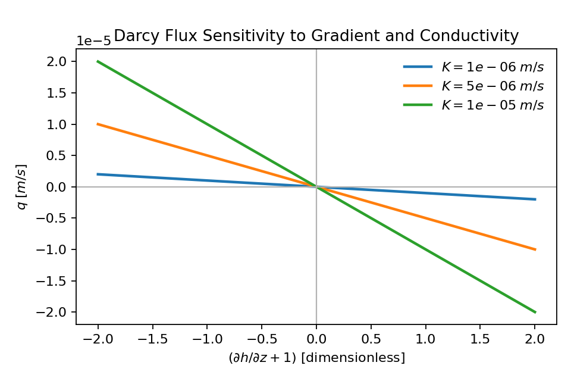
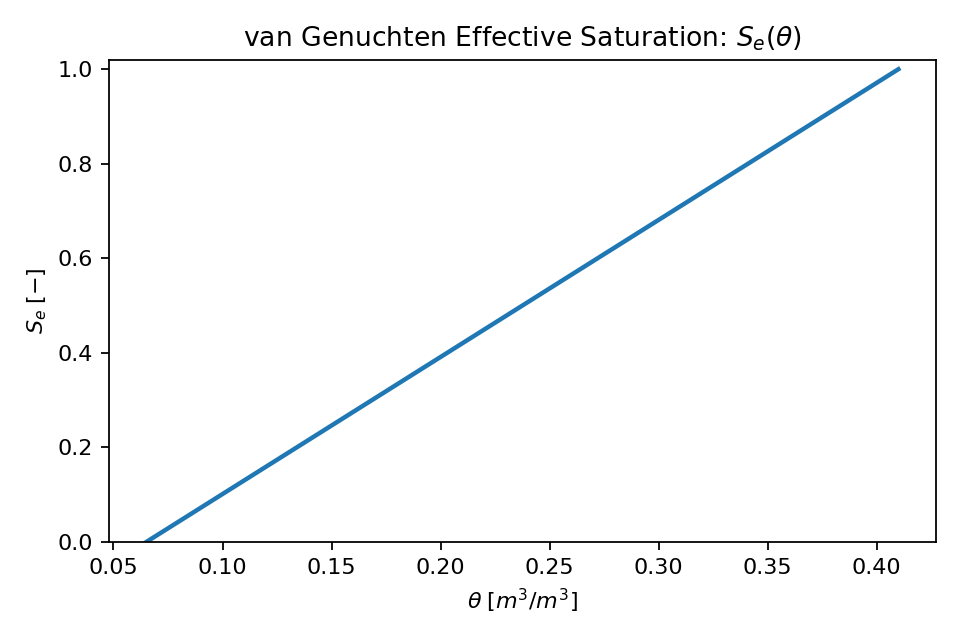
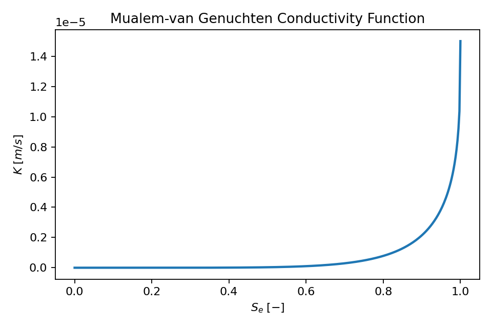
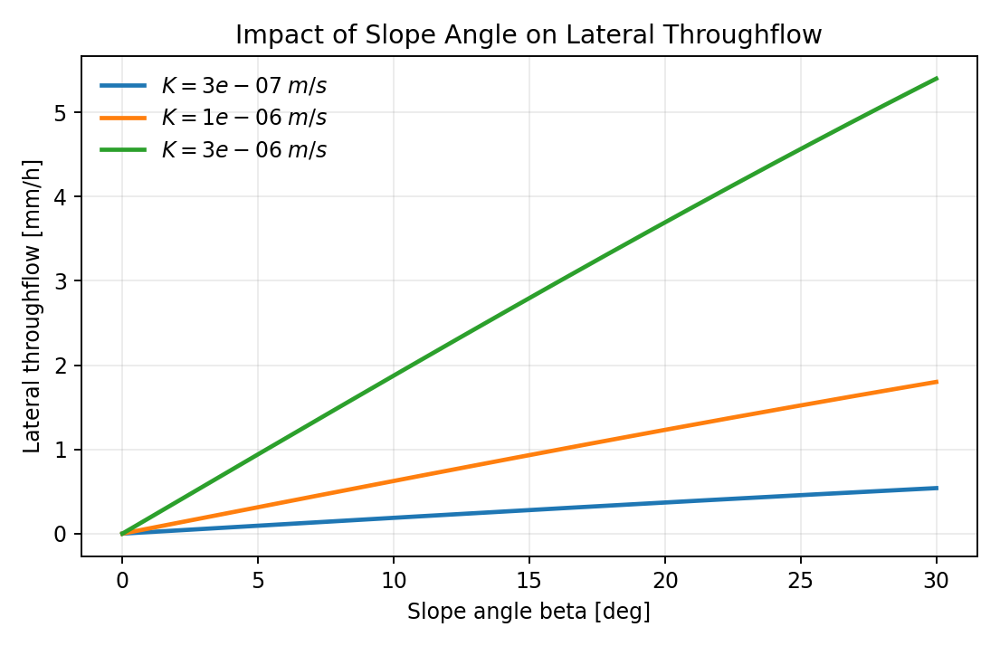
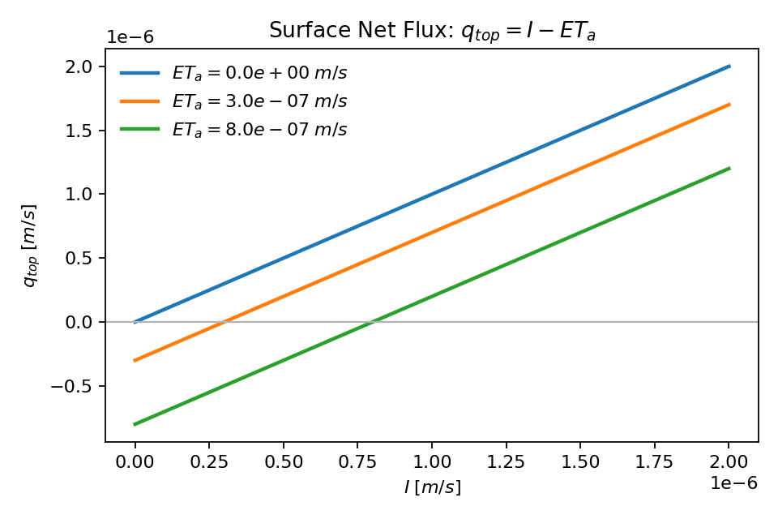
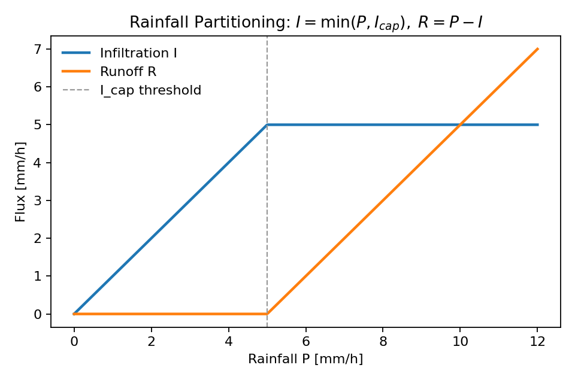
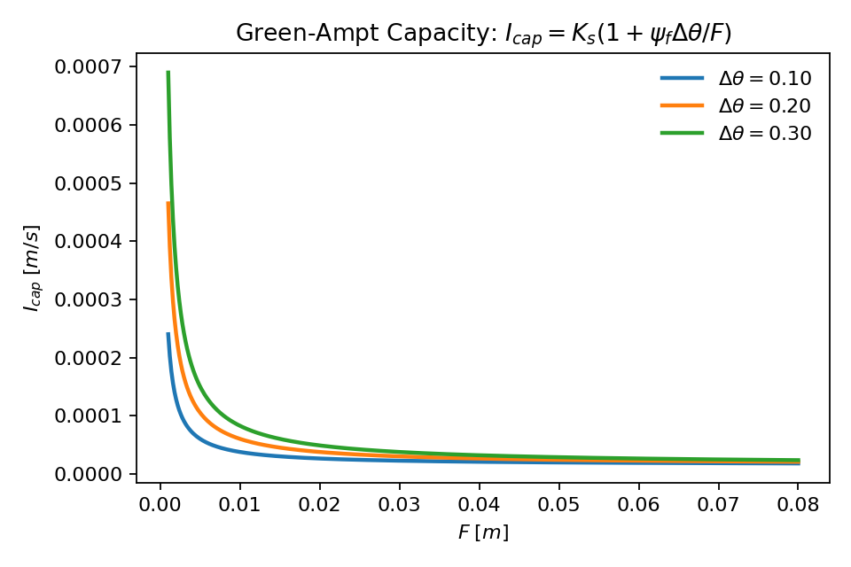
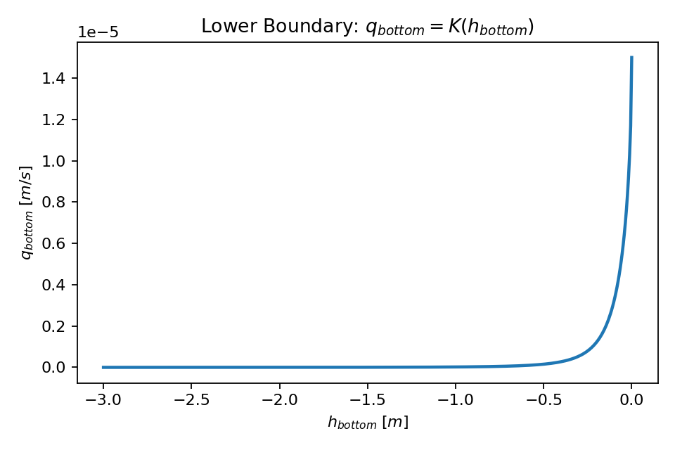

# ThetaFlow: A Richards equation simulator for vadose-zone dynamics.


ThetaFlow simulates 1D vertical water movement in a soil column using:

- Plain NumPy arrays to hold column state and fields
- The mixed-form Richards equation (Darcy flux + mass conservation)
- Van Genuchten-Mualem hydraulic functions
- A hillslope-angle lateral throughflow term for soil blocks on slopes
- Time-series forcing from rainfall and PET

The model is designed as a transparent, configurable research/teaching workflow for
unsaturated flow in a vertical soil profile.

## What the Model Solves

The code solves 1D vertical unsaturated flow by combining:

- Darcy's law for interface water fluxes
- Water mass conservation in each control volume
- Nonlinear constitutive relationships for `theta(h)` and `K(h)`
- Lateral gravity-driven throughflow based on slope angle

State variables at each soil layer are:

- `h` (pressure head, m)
- `theta` (volumetric water content, m3/m3)

## Model Equations

### 1) Mixed-form Richards equation (1D vertical)

In continuous form, the model follows:

$$
\frac{\partial \theta}{\partial t} = -\frac{\partial q}{\partial z}
$$

with Darcy flux:

$$
q = -K(h)\left(\frac{\partial h}{\partial z} + 1\right)
$$

Variable definitions for this equation pair:

- $\theta$: volumetric water content ($\mathrm{m^3\,m^{-3}}$)
- $t$: time (s)
- $z$: vertical coordinate, positive downward (m)
- $q$: vertical Darcian water flux (m/s), positive downward
- $h$: pressure head (m)
- $K(h)$: unsaturated hydraulic conductivity as a function of head (m/s)
- $\partial/\partial t$: partial derivative with respect to time
- $\partial/\partial z$: partial derivative with respect to depth

Line graph: Darcy flux response ($q$ vs hydraulic gradient for several $K$ values)



### 2) van Genuchten water retention curve

Effective saturation:

$$
S_e = \frac{\theta - \theta_r}{\theta_s - \theta_r}
$$

For unsaturated conditions (`h < 0`):

$$
S_e(h) = \left[1 + (\alpha |h|)^n\right]^{-m}, \quad m = 1 - \frac{1}{n}
$$

Then:

$$
\theta(h) = \theta_r + S_e(h)(\theta_s - \theta_r)
$$

Variable definitions for van Genuchten retention:

- $S_e$: effective saturation (dimensionless)
- $\theta$: volumetric water content ($\mathrm{m^3\,m^{-3}}$)
- $\theta_r$: residual volumetric water content ($\mathrm{m^3\,m^{-3}}$)
- $\theta_s$: saturated volumetric water content ($\mathrm{m^3\,m^{-3}}$)
- $h$: pressure head (m)
- $\alpha$: inverse air-entry parameter ($\mathrm{m^{-1}}$)
- $n$: shape parameter (dimensionless)
- $m$: van Genuchten parameter, $m=1-1/n$ (dimensionless)
- $|h|$: absolute value of pressure head

Line graph: requested view with $S_e$ on y-axis and $\theta$ on x-axis



For saturated/ponded conditions (`h >= 0`), the implementation caps to $S_e = 1$ and
$\theta = \theta_s$ (subject to numerical clipping near exact bounds).

### 3) Mualem-van Genuchten hydraulic conductivity

$$
K(S_e) = K_s S_e^l\left[1 - \left(1 - S_e^{1/m}\right)^m\right]^2
$$

Variable definitions for conductivity equation:

- $K(S_e)$: unsaturated hydraulic conductivity (m/s)
- $K_s$: saturated hydraulic conductivity (m/s)
- $S_e$: effective saturation (dimensionless)
- $l$: Mualem pore-connectivity parameter (dimensionless)
- $m$: van Genuchten parameter, $m=1-1/n$ (dimensionless)

Line graph: conductivity response ($K$ on y-axis, $S_e$ on x-axis)



### 4) Hillslope lateral throughflow (new)

For a soil block on slope angle $\beta$, the model computes layer-wise lateral
throughflow as:

$$
q_{lat,i} = K_i\sin(\beta)
$$

and applies it as a storage sink:

$$
\left(\frac{\partial\theta_i}{\partial t}\right)_{lat} = -\frac{q_{lat,i}}{L}
$$

where:

- $q_{lat,i}$: lateral throughflow flux in layer $i$ (m/s)
- $K_i$: unsaturated hydraulic conductivity at layer $i$ (m/s)
- $\beta$: slope angle (`simulation.slope_angle_deg`, degrees)
- $L$: hillslope flow path length (`simulation.hillslope_flow_path_m`, m)
- $\theta_i$: volumetric water content in layer $i$ ($\mathrm{m^3\,m^{-3}}$)

The equivalent profile-integrated lateral throughflow reported in diagnostics is:

$$
q_{lat,eq} = \sum_i \frac{q_{lat,i}\,\Delta z}{L}
$$

Line graph: impact of slope angle on lateral throughflow



## Numerical Implementation

The script uses an explicit finite-volume style update over layer thickness `dz`.
With hillslope lateral throughflow, the layer update is:

$$
\theta_i^{t+\Delta t} = \theta_i^t + \Delta t\left[
\frac{q_{i-1/2} - q_{i+1/2}}{\Delta z} - \frac{q_{lat,i}}{L}
\right]
$$

Interface fluxes are computed from averaged conductivity and local head gradient.

To improve stability, each forcing interval is split into adaptive sub-steps bounded by:

- `max_substep_seconds` (upper cap)
- `min_substep_seconds` (lower cap)
- `max_dtheta_per_substep` (target maximum moisture change per layer per sub-step)

After each moisture update, `theta` is converted back to `h` via the inverse
van Genuchten relation.

## Boundary Conditions and Forcing

### Upper boundary

At the surface:

$$
q_{top} = I - ET_a
$$

Variable definitions for surface flux equation:

- $q_{top}$: net downward surface flux into the soil (m/s)
- $I$: actual infiltration flux into soil (m/s)
- $ET_a$: actual evapotranspiration flux at the surface (m/s)

Line graph: surface net flux response ($q_{top}$ on y-axis, $I$ on x-axis)



Overland flow is generated when rainfall exceeds infiltration capacity:

$$
I = \min(P, I_{cap}), \quad R = P - I
$$

Variable definitions for rainfall partitioning equation:

- $P$: rainfall flux from `rainfall_mm_h`
- $I_{cap}$: infiltration capacity flux
- $I$: actual infiltration flux
- $R$: overland flow (Hortonian excess runoff)
- $\min(P, I_{cap})$: infiltration is capped by infiltration capacity

Line graph: rainfall partitioning ($I$ and $R$ on y-axis, $P$ on x-axis)



In ThetaFlow, infiltration capacity is computed with the Green-Ampt form:

$$
I_{cap} = K_s\left(1 + \frac{\psi_f\,\Delta\theta}{F}\right)
$$

Variable definitions for Green-Ampt capacity equation:

- $I_{cap}$: infiltration capacity (m/s)
- $K_s$: saturated hydraulic conductivity (m/s)
- $\psi_f$: wetting-front suction head (`green_ampt_wetting_front_suction_m`, m)
- $\Delta\theta = \theta_s - \theta_{surface}$: surface moisture deficit (dimensionless)
- $F$: cumulative infiltration depth since simulation start (m)

Line graph: Green-Ampt capacity ($I_{cap}$ on y-axis, $F$ on x-axis)



Potential ET input (`pet_mm_h`) is converted to flux and constrained so the top layer
does not drop below approximately `theta_r + min_theta_buffer` during a sub-step.

### Lower boundary

The bottom boundary is free drainage:

$$
q_{bottom} = K(h_{bottom})
$$

Variable definitions for lower boundary equation:

- $q_{bottom}$: bottom-boundary drainage flux (m/s)
- $K(h_{bottom})$: unsaturated hydraulic conductivity evaluated at bottom-node head (m/s)
- $h_{bottom}$: pressure head at the bottom node (m)

Line graph: lower boundary response ($q_{bottom}$ on y-axis, $h_{bottom}$ on x-axis)



(downward drainage under unit hydraulic gradient).

## Worked Example (One Time Step)

This section shows one approximate hand-calculation using the provided example settings.
Values are rounded for readability.

Given from [soil_properties_example.json](soil_properties_example.json):

- $\theta_r = 0.065$
- $\theta_s = 0.41$
- $\alpha = 3.6\ \text{m}^{-1}$
- $n = 1.56 \Rightarrow m = 1 - 1/n \approx 0.359$
- $K_s = 1.5\times10^{-5}\ \text{m/s}$
- $l = 0.5$

Initial condition:

- $h = -1.0\ \text{m}$ everywhere

Forcing during a rainy hour from [forcing_example.csv](forcing_example.csv):

- rainfall $= 4\ \text{mm/h}$
- PET $= 0.10\ \text{mm/h}$

Converted fluxes:

$$
P = \frac{4}{1000\times3600} \approx 1.11\times10^{-6}\ \text{m/s}
$$

$$
PET = \frac{0.10}{1000\times3600} \approx 2.78\times10^{-8}\ \text{m/s}
$$

At this wetness, PET demand is usually fully met at the surface, so:

$$
q_{top} = P - ET_a \approx 1.11\times10^{-6} - 2.78\times10^{-8}
\approx 1.08\times10^{-6}\ \text{m/s}
$$

### Step 1: Convert pressure head to moisture

At $h=-1$ m:

$$
S_e = [1 + (\alpha|h|)^n]^{-m} = [1 + 3.6^{1.56}]^{-0.359} \approx 0.66
$$

$$
\theta = \theta_r + S_e(\theta_s-\theta_r)
= 0.065 + 0.66\times(0.41-0.065)
\approx 0.29
$$

### Step 2: Compute unsaturated conductivity

$$
K = K_s S_e^l\left[1-(1-S_e^{1/m})^m\right]^2
\approx 1.5\times10^{-5}\times 0.066
\approx 9.9\times10^{-7}\ \text{m/s}
$$

This is close to the imposed surface inflow, so infiltration can proceed without
large immediate ponding in this simple case.

### Step 3: Flux divergence and moisture update

For top layer thickness $\Delta z=0.025$ m and a sub-step $\Delta t=60$ s,
the explicit update is:

$$
\Delta\theta \approx \frac{\Delta t}{\Delta z}(q_{in} - q_{out})
$$

Using $q_{in}\approx q_{top}=1.08\times10^{-6}$ m/s and
$q_{out}\approx K\approx 9.9\times10^{-7}$ m/s:

$$
\Delta\theta \approx \frac{60}{0.025}(8.7\times10^{-8})
\approx 2.1\times10^{-4}
$$

So the top-layer moisture changes from about $0.2930$ to $0.2932$ in this sub-step,
then the model repeats over all sub-steps and layers.

### Interpretation

- Rainfall raises near-surface moisture first.
- Conductivity increases as the soil wets, accelerating downward redistribution.
- After rainfall ends, PET and gravity drainage reduce near-surface moisture.
- These dynamics appear clearly in the generated moisture heatmap output.

## Inputs

### 1) Soil and model configuration (JSON)

Use `soil_properties_example.json` as a template.

Key fields:

- `soil.theta_r`: residual volumetric water content
- `soil.theta_s`: saturated volumetric water content
- `soil.alpha_per_m`: van Genuchten alpha (1/m)
- `soil.n`: van Genuchten n
- `soil.ks_m_per_s`: saturated hydraulic conductivity (m/s)
- `soil.pore_connectivity`: Mualem pore-connectivity parameter (often ~0.5)
- `column.nz`: number of soil layers (nodes)
- `column.dz_m`: layer thickness (m)
- `simulation.initial_head_m`: initial pressure head (m)
- `simulation.default_dt_hours`: used when forcing does not provide explicit timing
- `simulation.max_substep_seconds`: explicit integration sub-step limit
- `simulation.min_substep_seconds`: smallest adaptive sub-step allowed
- `simulation.max_dtheta_per_substep`: adaptive cap on moisture increment per sub-step
- `simulation.min_theta_buffer`: moisture buffer above residual for evaporation limiting
- `simulation.green_ampt_wetting_front_suction_m`: Green-Ampt wetting-front suction head
- `simulation.slope_angle_deg`: hillslope angle for lateral throughflow (degrees, default 6)
- `simulation.hillslope_flow_path_m`: representative lateral flow path length (m)

Recommended checks when supplying parameters:

- Ensure `theta_r < theta_s`
- Typical `n > 1`
- `ks_m_per_s` should be physically consistent with texture/structure
- `dz_m` and `max_substep_seconds` should be small enough for stable explicit updates
- If oscillations appear, reduce `max_substep_seconds` and/or `max_dtheta_per_substep`

### 2) Forcing time series (CSV)

Use `forcing_example.csv` as a template.

Required columns:

- `rainfall_mm_h`
- `pet_mm_h`

Optional timing columns:

- `timestamp` (preferred)
- `dt_hours` (if `timestamp` is not provided)

If neither is provided, `default_dt_hours` from JSON is used.

Unit conventions:

- Rainfall and PET are in mm/h
- Internally converted to m/s
- Time output is in elapsed hours

## Installation

```bash
python -m venv .venv
source .venv/bin/activate
pip install -r requirements.txt
```

If you are using conda, create/activate your environment first, then run:

```bash
pip install -r requirements.txt
```

## Run

```bash
python simulate_soil_column.py \
  --soil-config soil_properties_example.json \
  --forcing-csv forcing_example.csv \
  --output-dir outputs
```

Custom paths are fully supported via these command-line arguments.

## Outputs

Generated in `outputs/`:

- `soil_moisture_profiles.csv`: depth-wise moisture/head/conductivity at each forcing step
- `water_balance_diagnostics.csv`: rainfall, PET, estimated AET, infiltration/runoff, bottom drainage, and lateral throughflow
- `moisture_heatmap.png`: time-depth moisture visualization

### `soil_moisture_profiles.csv` columns

- `step`: forcing step index
- `time_hours`: elapsed simulation time (h)
- `timestamp`: timestamp if provided in forcing
- `depth_m`: node depth from surface (m)
- `theta`: volumetric water content (m3/m3)
- `head_m`: pressure head (m)
- `conductivity_m_per_s`: unsaturated hydraulic conductivity (m/s)

### `water_balance_diagnostics.csv` columns

- `slope_angle_deg`
- `rainfall_mm_h`
- `pet_mm_h`
- `aet_mm_h` (actual ET achieved under moisture limitation)
- `infiltration_mm_h` (rainfall that enters the soil column)
- `runoff_mm_h` (rainfall excess routed to overland flow)
- `cumulative_infiltration_mm` (Green-Ampt cumulative infiltration depth)
- `surface_net_downward_flux_mm_h`
- `bottom_drainage_mm_h`
- `lateral_throughflow_mm_h` (profile-integrated lateral throughflow equivalent flux)

## Visualization

`moisture_heatmap.png` is a depth-time map of `theta`:

- x-axis: simulation time (h)
- y-axis: depth (m, increasing downward)
- color: volumetric moisture

The figure now also includes time series panels for:

- rainfall
- runoff
- lateral throughflow (`lateral_throughflow_mm_h`)
- mean column moisture

This quickly shows infiltration fronts, redistribution, and drying periods.

## Key Variable Relationship Graph

The diagram below summarizes how forcing and soil parameters control fluxes, state
updates, and reported outputs.

```mermaid
flowchart LR
	A[Rainfall P and PET] --> B[Surface boundary
q_top = I - ET_a]
	C[Hydraulic properties
theta_r, theta_s, alpha, n, l, K_s] --> D[Retention and conductivity
S_e(h), theta(h), K(h)]
	J[Slope settings
beta, L] --> K[Lateral throughflow
q_lat = K sin(beta)]
	B --> E[Richards update
partial theta/partial t = -partial q/partial z]
	D --> E
	D --> K
	K --> E
	E --> F[Updated states
theta(z,t), h(z,t)]
	F --> G[Bottom drainage q_bottom]
	F --> H[Water balance diagnostics
infiltration, runoff, AET, lateral]
	F --> I[Result
moisture heatmap and profile outputs]
```

## Assumptions and Limitations

- Vertical Richards flow with an added lateral throughflow sink term for hillslopes
- Homogeneous soil hydraulic properties with depth
- Explicit time integration (can require small sub-steps for high conductivity / sharp fronts)
- PET is treated as near-surface evaporative demand (no explicit root profile yet)
- No hysteresis in the retention curve

## Notes on Physics and Stability

The solver uses:

- Darcy flux in 1D vertical form for each layer interface
- Continuity equation to update volumetric moisture
- Van Genuchten retention to map between pressure head and moisture
- Mualem conductivity model for unsaturated hydraulic conductivity

This is an explicit mixed-form implementation, so stability depends on chosen `max_substep_seconds`, soil conductivity, and layer spacing.

If runs become noisy or unstable, reduce:

- `simulation.max_substep_seconds`
- `column.dz_m`

and re-test mass-balance diagnostics.

## Suggested Extensions

- Add depth-distributed root water uptake function
- Add alternative lower boundary (fixed head / fluctuating water table)
- Add calibration workflow against observed profile moisture
- Export additional plots (profile snapshots, cumulative infiltration, cumulative ET)
